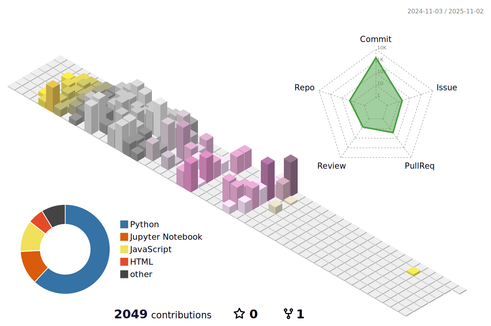

# Hello 👋, Here is MinKyungBae's GitHub 🐰.
***- Name*** : 배민경  
***- Birth*** : 26/04/2000  
***- Portfolio*** : *[Portfolio](https://github.com/minkyungbae/Portfolio.git)*  
***- How to contact me***  
  - Google Email : sea4536@gmail.com  
  - Naver Email : bmk0703@naver.com
## Here is included about...
- 📗 Studying Django in <a href="https://github.com/minkyungbae/Django">Django</a>
- 📘 Studying DRF in <a href="https://github.com/minkyungbae/DRF">DRF</a>
- 📘 practicing Backend and frontend in <a href="https://github.com/minkyungbae/Full-Stack">Full-Stack</a>
- 📙 Studying LLM & LangChain in <a href="https://github.com/minkyungbae/LLM_LangChain">LLM_LangChain
- 📚 Studying Programmers and BAEKJOON in <a href="https://github.com/minkyungbae/Study-about">Study-about</a>
- 📝 What I learned today in <a href="https://github.com/minkyungbae/TIL">TIL</a>
- 🧐 My assignments in <a href="https://github.com/minkyungbae/My-assignments/tree/main">My-assignments</a>
- 🤔 Other studies about in <a href="https://github.com/minkyungbae/Other-studying">Other-studying</a>

## Team Project Repository...
- 🎬 2 Weeks(250212~0226) of Team Project in <a href="https://github.com/Kkimminseo/UNO_BWMovie_recsys.git">BWMovie_recsys</a>
- 💫 1 Month(250227~0331) of Team Project in <a href="https://github.com/eungyukm/Miravelle.git">Miravelle</a>

## Intern Repository...
- 💿 Fix Column Format <a href="https://github.com/minkyungbae/intern_250507.git">intern_250507</a>
- 🕹️ YouTube Auto Crawling <a href="https://github.com/minkyungbae/crawling_auto_code.git">crawling_auto_code</a>

## Achievements

  
  

  

  

