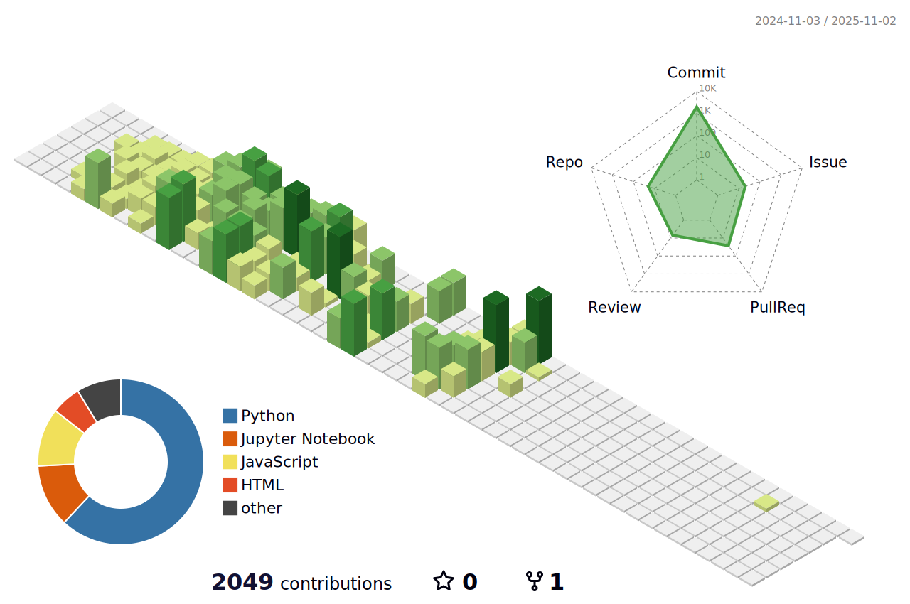

### About me 🐾

<h1 align="left"> Hello 👋, This is MinKyung Bae, a developer who codes dreams 😼.</h1>
<h3 align="left"> I'm looking forward to using AI to improve the quality of our life 🤖.</h3>
<h3 align="left"> So, Here is my history of study about AI and Python 📚.</h3>
<h3 align="left"> Let's get start! 🐈‍⬛</h3>

## Here is included about...
- 📚 Study about Programmers and BAEKJOON in [**Study-about**](https://github.com/minkyungbae/Study-about)
- 📝 What I learned today in [**TIL**](https://github.com/minkyungbae/TIL)
- 🧐 My assignments in [**My-assignments**](https://github.com/minkyungbae/My-assignments/tree/main)
- 🤔 Other stdudying about in [**Other-studying**](https://github.com/minkyungbae/Other-studying)
   

    

