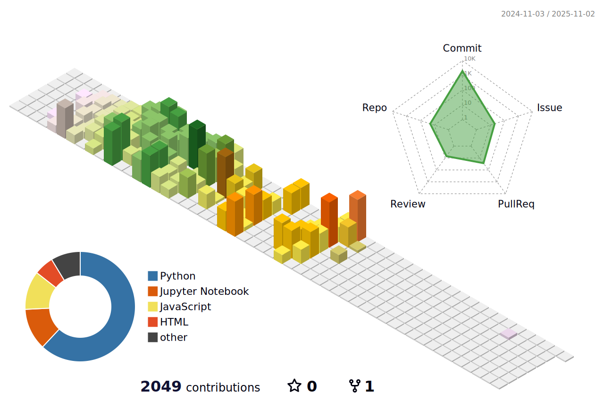

<h1 align="center"> Hello 👋, Here is MinKyungBae's GitHub 😼.</h1>

## Here is included about...
- 📗 Studying Django in [**Django**](https://github.com/minkyungbae/Django)
- 📘 Studying DRF in [**DRF**](https://github.com/minkyungbae/DRF)
- 📘 practicing Backend and frontend in [**Full-Stack**](https://github.com/minkyungbae/Full-Stack)
- 📚 Studying Programmers and BAEKJOON in [**Study-about**](https://github.com/minkyungbae/Study-about)
- 📝 What I learned today in [**TIL**](https://github.com/minkyungbae/TIL)
- 🧐 My assignments in [**My-assignments**](https://github.com/minkyungbae/My-assignments/tree/main)
- 🤔 Other studies about in [**Other-studying**](https://github.com/minkyungbae/Other-studying)
   

## Team Project Repository...
- 🎬 2 Weeks of Team Project in [BWMovie_recsys](https://github.com/Kkimminseo/UNO_BWMovie_recsys.git)

 
   

